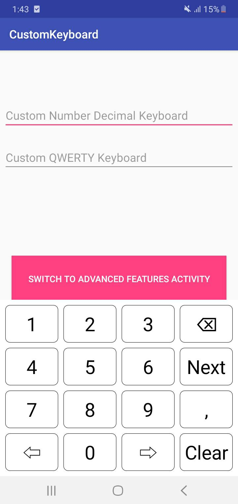

# Android-CustomKeyboard
Fully customizable Android keyboard written in Kotlin.

## Prerequisites
Make sure you have a version of Android Studio installed that supports Kotlin (3+ should be fine).

## Running the Demo
Just download the project, open it in Android Studio, connect to a virtual or physical device, and run it! There shouldn't be any further configuration required (unless you need to download build tools, etc., but Android Studio should prompt you to do that).

Below are images's of the keyboard. Notice that the keyboard takes up the full screen width, and the button widths change (they are a percentage of the screen width). That is because it extends the [ResizableRelativeLayout](https://github.com/DonBrody/Android-ResizableRelativeLayout). Additionally, the component responsible for the expansion and collapse of the keyboard is the [ExpandableView](https://github.com/DonBrody/Android-ExpandableView). Please take a look at their documentation for more detail.



## Why I Made It
The Samsung keyboard API has disabled changing the comma operator as per required. So, I forked the original library https://github.com/DonBrody/Android-CustomKeyboard and worked on creating a more customised keyboard view and functionalities to facilitate the following changes:
1. Set the decimal separator(default value is ',')
2. Set the thousand separator(for grouping digits, default is '.')
3. Increase or Decrease text size(default value is 22.0F)
4. Set the background colour of keyboard(default value is white)

## How It Works
The `CustomisedKeyboardView` can be injected with any keyboard layout and controller. All you need to do is create an `EditText`, pass it to the `CustomisedKeyboardView`, and indicate what keyboard type it should be using. Below is the entire `MainActivity` demo class:
```
class MainActivity : AppCompatActivity() {
    private lateinit var keyboard: CustomisedKeyboardView

    override fun onCreate(savedInstanceState: Bundle?) {
        super.onCreate(savedInstanceState)
        setContentView(R.layout.activity_main)

        val numberField: EditText = findViewById(R.id.testNumberField)
        val numberDecimalField: EditText = findViewById(R.id.testNumberDecimalField)
        val qwertyField: EditText = findViewById(R.id.testQwertyField)

        keyboard = findViewById(R.id.customKeyboardView)
        keyboard.setTextFontSize(30.0F)
        keyboard.setDecimalsSeparator(',')
        keyboard.setThousandsSeparator('.')
        keyboard.setBackgroundColor(Color.WHITE)
        keyboard.registerEditText(CustomisedKeyboardView.KeyboardType.NUMBER, numberField)
        keyboard.registerEditText(
            CustomisedKeyboardView.KeyboardType.NUMBER_DECIMAL,
            numberDecimalField
        )
        // can separately add any TextWatcher
        numberDecimalField.addTextChangedListener(
            CustomTextWatcher(
                numberDecimalField,
                ',',
                '.'
            )
        )
        keyboard.registerEditText(CustomisedKeyboardView.KeyboardType.QWERTY, qwertyField)

        val switchActivitiesButton: Button = findViewById(R.id.switchActivitiesButton)
        switchActivitiesButton.setOnClickListener {
            startActivity(
                Intent(
                    this@MainActivity,
                    AdvancedFeaturesActivity::class.java
                )
            )
        }
    }

    override fun onBackPressed() {
        if (keyboard.isExpanded) {
            keyboard.translateLayout()
        } else {
            super.onBackPressed()
        }
    }
}
```
The `EditText`'s are stored in a map by the `CustomisedKeyboardView`:
```
private val keyboards = HashMap<EditText, KeyboardLayout?>()
```
As you can see, they are mapped to their `KeyboardLayout`, which stores its own controller. This process is shown below:
```
    fun registerEditText(type: KeyboardType, field: EditText) {
        field.setRawInputType(InputType.TYPE_CLASS_TEXT)
        field.setTextIsSelectable(true)
        field.showSoftInputOnFocus = false
        field.isSoundEffectsEnabled = false
        field.isLongClickable = false

        val inputConnection = field.onCreateInputConnection(EditorInfo())
        keyboards[field] = createKeyboardLayout(type, inputConnection)
        ...
    }
    
    private fun createKeyboardLayout(type: KeyboardType, ic: InputConnection): KeyboardLayout? {
            when (type) {
                KeyboardType.NUMBER -> {
                    return NumberKeyboardLayout(context, createKeyboardController(type, ic))
                }
                KeyboardType.NUMBER_DECIMAL -> {
                    return NumberDecimalKeyboardLayout(
                        context,
                        createKeyboardController(type, ic),
                        decimalSeparator,
                        textSize,
                        gapSize,
                        bgColor
                    )
                }
                KeyboardType.QWERTY -> {
                    return QwertyKeyboardLayout(context, createKeyboardController(type, ic))
                }
                else -> return@createKeyboardLayout null // this should never happen
            }
    }

    private fun createKeyboardController(
            type: KeyboardType,
            ic: InputConnection
        ): KeyboardController? {
            return when (type) {
                KeyboardType.NUMBER_DECIMAL -> {
                    NumberDecimalKeyboardController(ic)
                }
                else -> {
                    // not all keyboards require a custom controller
                    DefaultKeyboardController(ic)
                }
            }
    }
```
You might also notice that the `CustomisedKeyboardView` is currently using some very basic controllers, so why would we separate the controller logic from the layout? Because more complicated controllers may be needed in the future. This architecture allows for more complex keyboard layouts to be created. For example, what if we need to create a keyboard that handles latitudes. That can get pretty complicated. Not only do we have to consider that latitudes can only span between S 90.0000 and N 90.0000 degrees, but what if we want to represent those values in degrees and minutes, or degrees and minutes and seconds, or whatever format the user chooses? The architecture might be a little overkill for simple keyboards, but it leaves open the possibility to create any keyboard we may need to in the future without any significant changes to the architecture.

## Advanced Use
The `CustomisedKeyboardView` is capable of auto registering all `EditText`'s within a `ViewGroup`. Just pass any `ViewGroup` to the `autoRegisterEditTexts` method of any `CustomisedKeyboardView` instance, and it will recursively search the `View` tree for `EditText`'s, check their type, and automatically bind to their `InputConnection`'s.

Additionally, there is a `CustomTextField` component. This component is a simple extension of the Android `EditText` component. It auto sets simple settings such as background color, max characters, and text size. The most important addition to this extension is the keyboard type property. You can create this component programmaticaly, set it's type, and pass it's containing `ViewGroup` to the `CustomisedKeyboardView` to auto bind to it's `InputConnection`. This allows you to create keyboard types that are not recognized by Android, set the keyboard type of this new component, and have that type auto recognized by the `CustomisedKeyboardView`. 
Note: The `CustomTextField` is a very simple component, and like the custom keyboard's in this repository, it's expected that you'll override their attributes to fit your project's needs.

Take a look at the [`AdvancedFeaturesActivity.kt`](/app/src/main/java/com/quantuminventions/customkeyboard/AdvancedFeaturesActivity.kt) class to see examples of advanced use.

Also, the View in which one is adding this custom keyboard has bottom nav bar then in layout you can add as below. Here , A coordinator layout has been to show Snackbar on top of the keyboard layout.

```
 <!-- Coordinator Layout used to position the SnackBar -->
        <androidx.coordinatorlayout.widget.CoordinatorLayout
            android:id="@+id/anchorForSnackBarLayout"
            android:layout_width="match_parent"
            android:layout_height="wrap_content"
            android:background="@android:color/transparent"
            app:layout_constraintBottom_toTopOf="@+id/customKeyboardView" />

        <com.qinvent.customkeyboard.CustomisedKeyboardView
            android:id="@+id/customKeyboardView"
            android:layout_width="match_parent"
            android:layout_height="wrap_content"
            app:layout_constraintBottom_toBottomOf="parent" />
 ```

 Also, you can use below code snippet to find device name and decide to use default keyboard or this custom keyboard :

 ```
 /**
      * Provides the device name i.e, the manufacturer and model of the device
      * From https://stackoverflow.com/a/12707479/17286476.
      *
      * @return [String] the device name (Manufacture + Model)
      */
     private fun getDeviceName(): String {
         val manufacturer = Build.MANUFACTURER
         val model = Build.MODEL
         return if (model.lowercase(Locale.getDefault())
                 .startsWith(manufacturer.lowercase(Locale.getDefault()))
         ) {
             model.capitalize()
         } else {
             "${manufacturer.capitalize()} $model"
         }
     }
 ```

## Next Steps
Add the `CustomisedKeyboardView` to any of your projects, add any layout or controllers you'd like, modify the UI in any way that fits your needs, and enjoy!

Additional work that can be done:
 Disabling user from changing the cursor position in the Edit text which use CustomisedKeyboardView.

## Dependencies
* [ResizableRelativeLayout](https://github.com/quantuminventions/customkeyboard/components/ResizableRelativeLayout)
* [ExpandableView](https://github.com/quantuminventions/customkeyboard/components/expandableView/ExpandableView)

## Used By

This library is used by the following applications:

- [x]  TrackSYNQ Driver

## Acknowledgements
- https://github.com/DonBrody/Android-CustomKeyboard
- https://stackoverflow.com/a/12707479/17286476

## License
This project is licensed under the MIT License - see the [LICENSE](LICENSE) file for details
